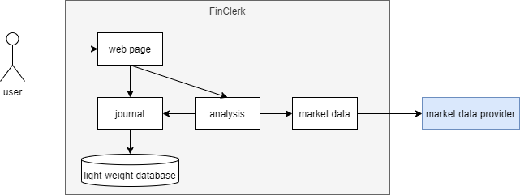

# Memo

## Insight

Civillians like me usually use financial cellphone apps to trade financial instruments. Most civillians care about short term market fluctuations. Therefore, most apps are designed to do short term earning analysis, even with some intentional misleading. However, I focus on long term market growth.

For long term market growth, there are some professional tools to make investment decisions. But I want to know my actual earnings after the previous decisions.

It is hard to find an analysis tool available to civillians that meets my requirement. Therefore, I decided to develop my own earning analysis tool.

## Idea

This tool is called **FinClerk**. It helps me record investment activities and analyze investment earnings.

I need following functions in FinClerk:
1. It supports multiple users since I may publish this tool as a service.
1. Each time I trade, I record the trading details in FinClerk.
1. I can view all my historical trades that I recorded in FinClerk.
1. I can analyze earnings of specified instruments and periods by FinClerk, based on the market fluctuations.

## Design Imagination

Essentially, FinClerk is a web service. Therefore, a **web page** module is needed for web page as the user interface.

**Journal** module handles trading record management. The trading records are persisted in a **light-weight database**.

**Analysis** module analyzes earnings based on the trading records from journal module and the market data from **market data** module.

Market data module fetches market data like price from external *market data providers* like [eastmoney](https://www.eastmoney.com/).

